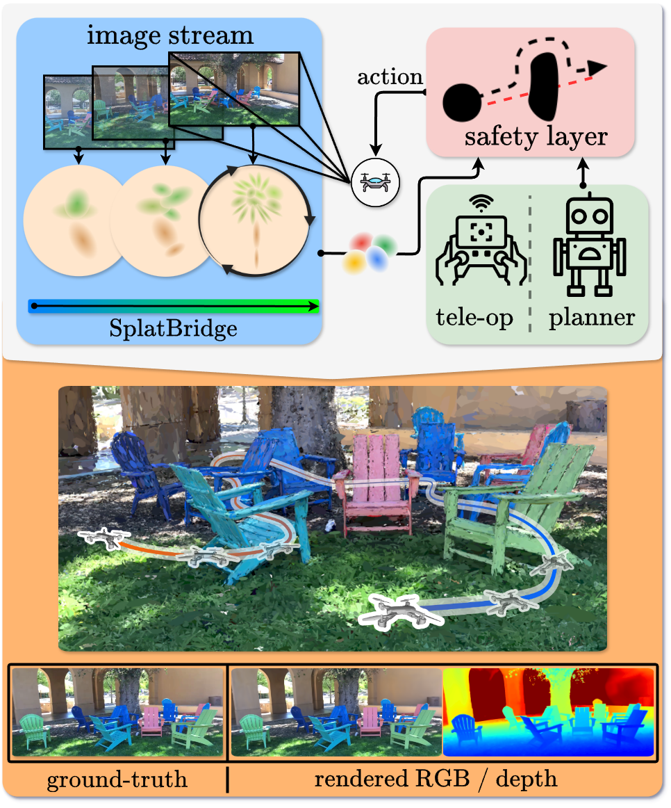

<!-- # SAFER-Splat
### [Project Page](https://chengine.github.io/safersplat) | [Paper (ICRA)]() | [Paper (arXiv)]() | [Data](https://drive.google.com/drive/u/1/folders/1xSu7bFW8OBRd9YHfz3LzdBx7pDjUHEPh)
[SAFER-Splat: Simultaneous Action Filtering and Environment Reconstruction]()  
 [Timothy Chen](https://msl.stanford.edu/people/timchen)\*<sup>1</sup>,
 [Aiden Swann](https://msl.stanford.edu/people/timchen)\*<sup>1</sup>,
 [Javier Yu](https://msl.stanford.edu/people/timchen)\*<sup>1</sup>,
 [Ola Shorinwa](https://www.its.caltech.edu/~pculbert/)\*<sup>1</sup>,
 [Riku Murai](https://www.its.caltech.edu/~pculbert/)\*<sup>2</sup>,
 [Monroe Kennedy III](https://www.its.caltech.edu/~pculbert/)\*<sup>1</sup>,
 [Mac Schwager](https://web.stanford.edu/~schwager/)\*<sup>1</sup>,
 <sup>1</sup>Stanford, <sup>2</sup>Princeton, <sup>3</sup>Imperial College London
in IEEE Transactions on Robotics (2024)

 -->

<p align="center">

  <h1 align="center"> SAFER-Splat: Simultaneous Action Filtering and Environment Reconstruction</h1>
  <p align="center"> 
    <a href="https://msl.stanford.edu/people/timchen"><strong>Timothy Chen</strong><sup>1</sup></a>
    ·
    <a href="https://aidenswann.com/"><strong>Aiden Swann</strong><sup>1</sup></a>
    ·
    <a href="https://msl.stanford.edu/people/javieryu"><strong>Javier Yu</strong><sup>1</sup></a>
    ·
    <a href="https://msl.stanford.edu/people/olashorinwa"><strong>Ola Shorinwa</strong><sup>1</sup></a>
    ·
    <a href="https://rmurai.co.uk/"><strong>Riku Murai</strong><sup>2</sup></a>
    ·
    <a href="https://me.stanford.edu/people/monroe-kennedy"><strong>Monroe Kennedy III</strong><sup>1</sup></a>
    ·
    <a href="https://web.stanford.edu/~schwager/"><strong>Mac Schwager</strong><sup>1</sup></a>
  </p>
  <p align="center"><strong><sup>1</sup>Stanford University</strong></p>
  <p align="center"><strong><sup>2</sup>Imperial College London</strong></p>
  <h2 align="center">Submitted ICRA 2025</h2>
  <h3 align="center"><a href="https://chengine.github.io/safer-splat"> Project Page</a> | <a href=>Paper(TBD)</a> | <a href= "https://www.arxiv.org/abs/2409.09868">(arXiv)</a> | <a href="https://drive.google.com/drive/folders/1xSu7bFW8OBRd9YHfz3LzdBx7pDjUHEPh?usp=sharing">Data</a></h3>
  <div align="center"></div>
</p>
<p align="center">
  <a href="">
    
  </a>
</p>
<h3 align="center">
SAFER-Splat (Simultaneous Action Filtering and Environment Reconstruction) is a real-time, scalable, and minimally invasive action filter, based on control barrier functions, for safe robotic navigation in a detailed map constructed at runtime using Gaussian Splatting.
</h3>

## About
We propose a novel Control Barrier Function (CBF) that not only induces safety with respect to all Gaussian primitives in the scene, but when synthesized into a controller, is capable of processing hundreds of thousands of Gaussians while maintaining a minimal memory footprint and operating at 15 Hz during online Splat training. Of the total compute time, a small fraction of it consumes GPU resources, enabling uninterrupted training. The safety layer is minimally invasive, correcting robot actions only when they are unsafe. To showcase the safety filter, we also introduce SplatBridge, an open-source software package built with ROS for real-time GSplat mapping for robots. We demonstrate the safety and robustness of our pipeline first in simulation, where our method is 20-50x faster, safer, and less conservative than competing methods based on neural radiance fields. Further, we demonstrate simultaneous GSplat mapping and safety filtering on a drone hardware platform using only on-board perception. We verify that under teleoperation a human pilot cannot invoke a collision.

## TODOs
1. Upload SplatBridge and ROS nodes.
2. Upload visualizer of trajectories in Nerfstudio viewer.
3. Provide interactive Colab notebook that allows users to interface with the safety layer on a trained Splat.

## Dependencies
This repository is built off of [Nerfstudio](https://github.com/nerfstudio-project/nerfstudio/tree/main). Please first follow the installation instructions there before installing any of the dependencies specifically for this repository. Once you have Nerfstudio installed in your Conda environment, install the following dependencies in that environment.

* [CLARABEL](https://github.com/oxfordcontrol/Clarabel.rs). This library is for solving the quadratic program.

## Datasets
Our datasets are hosted on a [Google Drive](https://drive.google.com/drive/folders/1xSu7bFW8OBRd9YHfz3LzdBx7pDjUHEPh?usp=sharing). The scenes used in the paper are `flightgate`, `statues`,  `stonehenge`, `adirondacks`. The training data is in the `data` folder, while the model parameters are in `outputs`. You can drag and drop these folders into your working directory.

Here's an example:
```
SAFER-Splat
├── data                                                                                                       
│   └── flight
│       └── images
│       └── transforms.json                                                                                  
│                                                                                               
├──outputs                                                                                                                                                      
│   └── flight                                                                                                  
│       └── splatfacto                                                                                                                             
│           └── 2024-09-12_172434                                                                               
│               └── nerfstudio_models
|               └── config.yml
|               └── dataparser_transforms.json # This file contains the transform that transforms from "Data" frame to "Nerfstudio" frame (which is typically a unit box)
├── run.py
```

## Running SAFER-Splat
After the dependencies and the data is setup, run
```
python run.py
```

The most important thing is to ensure that the path in NeRFWrapper is pointing to the right model location.

### Variants
The variants for the distance can be changed.

### Visualizing the paths
Under construction...

## Generating your own scenes
To use your own datasets, simply train a Nerfstudio `splatfacto` model and follow the folder structure as illustrated above. If your images contain pixels that are transparent like in the case of synthetic scenes (i.e. the alpha value is 0), it is recommended to use the `instant-ngp-data` flag (e.g. `ns-train splatfacto --data {DATA} instant-ngp-data`) rather than `blender-data` or the default.

## Citation
If you found SAFER-Splat useful, consider citing us! Thanks!
```
@misc{chen2024safersplatcontrolbarrierfunction,
      title={SAFER-Splat: A Control Barrier Function for Safe Navigation with Online Gaussian Splatting Maps}, 
      author={Timothy Chen and Aiden Swann and Javier Yu and Ola Shorinwa and Riku Murai and Monroe Kennedy III au2 and Mac Schwager},
      year={2024},
      eprint={2409.09868},
      archivePrefix={arXiv},
      primaryClass={cs.RO},
      url={https://arxiv.org/abs/2409.09868}, 
}
```